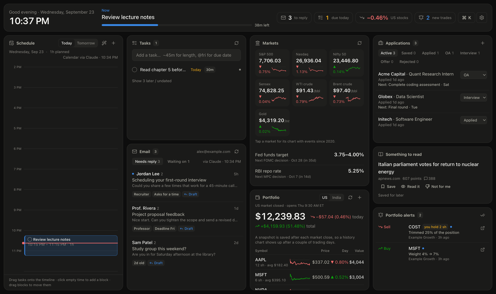

# Personal dashboard

A dark, one-screen dashboard for your day: what to do now, your schedule and tasks, email you owe a reply, markets and your portfolio, job applications, and deadline alerts on your phone. It runs free on Cloudflare, sits behind a login only you can pass, and a scheduled Claude task keeps it current by reading your Gmail and Google Calendar a few times a day.


<sub>Demo data. Every person, company and email here is made up.</sub>

## Get your own copy

Make a private copy from this template (or click **Use this template** on GitHub):

```bash
gh repo create my-dashboard --template anmolsingh0219/personal-dashboard-template --private --clone
cd my-dashboard
```

**Then set it up with Claude:** open the folder in [Claude Code](https://claude.com/claude-code) (or the Claude desktop app's Code tab) and say:

> Set up this dashboard for me.

Claude follows [SETUP_WITH_CLAUDE.md](SETUP_WITH_CLAUDE.md). It asks about your markets, email and schedule, customizes the code, runs it locally, deploys it to your Cloudflare account, and sets up the daily refresh and phone alerts. The steps work by hand too.

## What's on it

| Panel | What it does |
|---|---|
| **Now** (top) | The current block with a countdown, what's next, missed blocks, and counts for replies owed, tasks due, job steps due, new portfolio alerts, and today's move in whichever stock market is open. |
| **Schedule** | Today and tomorrow, with your calendar events plus blocks you plan. Drag tasks onto it, drag blocks to move them, or click empty time to add one. **Auto-plan** packs tasks due in the next 3 days into your free time. The scheduled Claude task copies your blocks into Google Calendar, so your phone reminds you. |
| **Tasks** | Quick add: `Problem set ~90m @fri` sets a 90-minute estimate and a Friday due date. Two-way with Google Tasks if you connect Google directly. |
| **Email** | *Needs reply*: threads where a real person is waiting on you, ranked by urgency, each with a suggested reply. *Waiting on*: mail you sent that nobody answered. Filled by the scheduled Claude task; read-only. |
| **Markets** | Live index, commodity and currency tiles, policy rates with next meeting dates, "what's moving" notes and headlines. Tap a tile or a holding for a candlestick chart (1D to since 2020), with a **Major events** switch that marks COVID, rate moves, wars, tariffs and elections on it. |
| **Portfolio** | Your holdings with live quotes, day and total gain, and a history chart built from daily snapshots. Several portfolios (e.g. US and India) in their own currencies. The panel shows whichever market is open, with a manual switch. |
| **Applications** | Job pipeline (saved → applied → OA → interview → offer / rejected), kept current from application emails by the scheduled task, each linked to its email. |
| **Portfolio alerts** | Trades and rebalances of a portfolio you copy (e.g. on Autopilot), read from its emails, marked "not in yours" or "you hold N sh". |
| **Something to read** | One Hacker News front-page pick a day, boosted by topics you set. |

Also:
- **Deadline alerts on your phone:** tasks and application steps with a due date notify you at 7 PM the day before and 8 AM on the day. This uses Web Push; on iPhone, add the dashboard to your Home Screen first.
- **⌘K** (or `/`) opens a command palette: type a task to add it, start a block now, auto-plan, or jump to a panel.

## How it works

```
┌─────────────── Your computer ───────────────┐        ┌────────── Cloudflare (free) ──────────┐
│ Claude Desktop scheduled task (9:30, 1, 5)   │        │ Access login (only your email)        │
│  · reads Gmail + Google Calendar (read-only) │  push  │ Worker (Hono API) + static React app  │
│  · checks rates and market news              │ ─────▶ │ D1 database (SQLite)                  │
│  · writes JSON, runs node scripts/push-*.ts  │        │ Crons: portfolio snapshots, alerts    │
└──────────────────────────────────────────────┘        └───────────────┬───────────────────────┘
                                                                         │ live quotes (Yahoo),
                                          phone ◀── Web Push alerts ─────┤ news RSS, Hacker News
```

- **Frontend:** React 19, Vite, Tailwind v4, TanStack Query, lightweight-charts.
- **Backend:** a Cloudflare Worker (Hono) serving the API and the static app, D1 for storage, cron triggers for portfolio snapshots and deadline alerts, and Web Push (VAPID) for notifications.
- **Security:** Cloudflare Access sits in front of everything, and the Worker also verifies the Access token. It refuses every request until Access is configured. Tokens are encrypted at rest; the scheduled task can't send email.
- **No Google Cloud project needed.** Email and calendar arrive through Claude's own connectors. A direct Google OAuth connection is optional (below).

```
shared/config.ts          your settings: time zone, portfolios, market tiles, news feeds
scripts/refresh-brief.md  what the scheduled Claude task does (owner profile at the top)
src/                      React app (components/ = panels)
worker/                   API: routes/, lib/ (quotes, Gmail rules, Web Push, …)
shared/                   types and logic shared by app, API and scripts
migrations/               D1 schema
tests/                    Vitest (email rules, planner, push encryption, config checks, …)
```

## Set it up by hand

The full walkthrough, with troubleshooting, is in [SETUP_WITH_CLAUDE.md](SETUP_WITH_CLAUDE.md). The short version:

**Requirements:** Node.js 22.18+, a free Cloudflare account, and Claude Desktop with the Gmail and Google Calendar connectors (for the email and calendar panels).

```bash
npm install
npm run setup           # .dev.vars, encryption + push keys, local database
npm run dev             # http://localhost:5173
```

Then personalize `shared/config.ts` and the owner profile in `scripts/refresh-brief.md`, and deploy:

```bash
npx wrangler login
npx wrangler d1 create dashboard        # put the database_id in wrangler.jsonc
npm run db:migrate:remote
npm run deploy                          # prints https://dashboard.<you>.workers.dev
npm run setup -- --url https://dashboard.<you>.workers.dev
grep '^TOKEN_KEY=' .dev.vars | cut -d= -f2- | npx wrangler secret put TOKEN_KEY
grep '^VAPID_PRIVATE_KEY=' .dev.vars | cut -d= -f2- | npx wrangler secret put VAPID_PRIVATE_KEY
```

Turn on **Cloudflare Access** for the workers.dev URL, put the team domain and AUD tag in `wrangler.jsonc`, and run `npm run deploy` again (details in the setup guide). Finally, create the scheduled tasks from `scripts/scheduled-task-prompt.md`.

## Google setup (optional: connect Google directly)

Instead of the scheduled Claude task, the dashboard can read Gmail, Calendar and Google Tasks live through your own Google OAuth client:

1. At [console.cloud.google.com](https://console.cloud.google.com), create a project and enable the **Gmail**, **Google Calendar** and **Google Tasks** APIs.
2. Set up the OAuth consent screen (External, with yourself as a test user), then **Publish** the app. In Testing mode Google expires your login every 7 days.
3. Create a **Web application** client with redirect URIs `http://localhost:5173/api/google/callback` and `https://dashboard.<you>.workers.dev/api/google/callback`.
4. Put `GOOGLE_CLIENT_ID` and `GOOGLE_CLIENT_SECRET` in `.dev.vars`, and upload them with `npx wrangler secret put`. Then open Settings → **Connect Google**.

### If your Google Workspace blocks Gmail

School and company Google accounts often block unverified apps (*"Access blocked"* / `admin_policy_enforced`). Use the scheduled Claude task instead (it uses Claude's approved connectors), or forward that mail to a personal Gmail and connect that.

## Free-tier limits it's built around

- Workers free plan: 100k requests a day and 50 outbound requests per request. Holdings are capped at 20, and Gmail is read in batches.
- Quotes, headlines and calendar responses are cached in D1 for 1–10 minutes.
- Five cron triggers per account: one snapshot per market close, plus an hourly check that sends alerts only at 8 AM and 7 PM.
- Cloudflare Access is free for up to 50 users.

## License

MIT. See [LICENSE](LICENSE).
